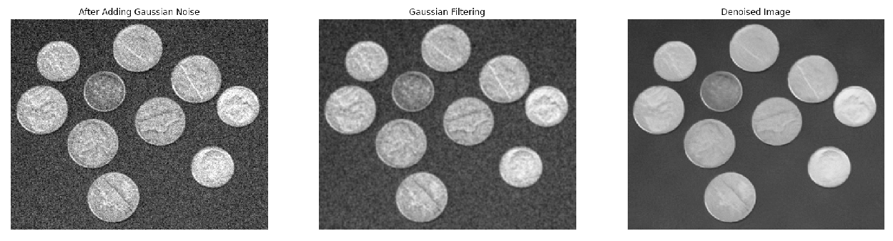
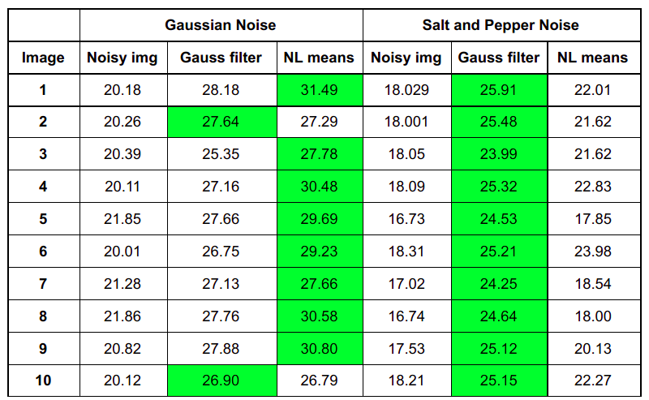

# Non Local Means Image denoising
This is a python implementation of [A non-local algorithm for image denoising](https://ieeexplore.ieee.org/document/1467423) paper. Here is the colab [link](https://colab.research.google.com/drive/1QzhJ-eEW7qEJZFB0JRscGWfyBIwmv-V6?usp=sharing) for this code.

## Config Files Parameters and assumptions
* Patch size = 7. This is mainly because it was somewhat neither too large nor too small. Too large a size would mean very few patches are similar to the current patch and too small would make a huge number of patches similar. (paper has also taken 7)
* Search Size = 21x21 window around the current pixel. This is mainly from a time complexity point of view. 
* h = 0.1, std of gaussian kernel(a)=1.5. This is because that was when the image was denoised the best. The function from scikit image library also suggests the same 
* Sigma = 0.1. The standard deviation of the noise added. 

## Results
### Qualitative

### Quantitative
Peak Signal to Noise Ratio results for 10 different images and comparision between gaussian denoising method and NL means image denoising method is as shown below

